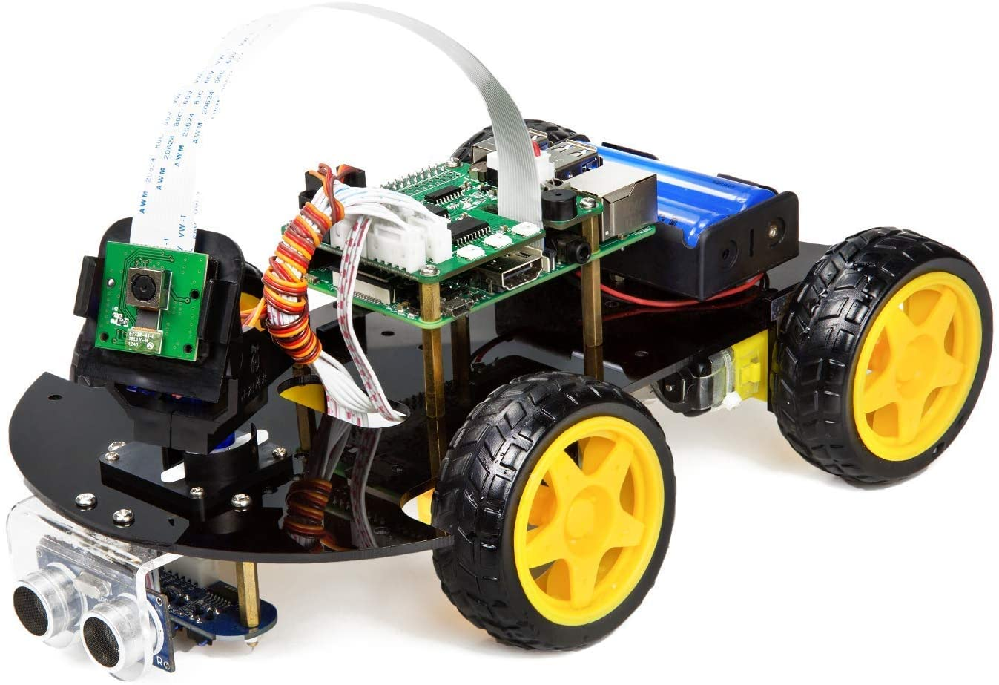

# PI-ROBOT-CAT



Credit: [UCTRONICS](https://www.uctronics.com/)

The purpose of this project is to replace the [C language UCTRONICS Raspberry PI Robot Car server](https://github.com/UCTRONICS/UCTRONICS_Smart_Robot_Car_RaspberryPi) that controls the hardware by a [Node.js](https://nodejs.org/en/) implementation.

The requirements are:

* With the exception of bluetooth remote control, all original features are functional.
* Control over the internet using secure connection is possible.
* Focus is on the server running on Node.js (Although a basic Vue.js UI is provided for demostration purposes).
* Compatibility with UCTRONICS mobile app is not required.
* Open source, of course.

The instructions below assume you already setup your Raspberry PI with Debian, and the following software is already installed. In parenthesis the versions this project has been tested the last time.

* Debian (jester)
* git (2.20.1)
* npm (6.14.5)
* node (v12.8.2)
* vue-cli (4.4.6)

## Required materials

* [UCTRONICS Robot Car Kit for Raspberry Pi](https://amzn.to/3dhvFIv)
* [Raspberry PI 3B+](https://amzn.to/3nvSb5i)
* [microSDHC Card](https://amzn.to/2SAb0G4)

## Block Diagram


Block diagram

In the block diagram above the green boxes represent the implementaton of this project.

## MJPEG Streamer

The MJPEG streamer project is used to stream the camera module video feed. Follow the complete instructions in the following link.

[MJPEG-Streamer Install & Setup](<https://github.com/cncjs/cncjs/wiki/Setup-Guide:-Raspberry-Pi-%7C-MJPEG-Streamer-Install-&-Setup-&-FFMpeg-Recording>)

## Get a domain name

In order to access the Robot Car application from the internet get a domain name. [DuckDNS](https://www.duckdns.org) will provide a duckdns subdomain resolving to your Internet Service Provider IP address.

### Set up the port forwarding on your home router

Once the domain name resolves to your home router external IP address, the router needs to forward traffic on ports 80 and 443 to your Raspberry Pi ip address. The instructions depends on your router. Information, very likely, is available by searching for "port forwarding [your router brand and model]"

## NGINX installation

In this project we are using [NGINX](https://www.nginx.com/resources/wiki/) as web server and reverse proxy.

### Get an SSL certificate from LetsEncrypt

We need a valid certificate to establish a secure connection to the server running on the Raspberry PI.

### Install certbot

The instructions below are from [certbot.eff.org](<https://certbot.eff.org/lets-encrypt/debianbuster-nginx>)

````bash
    sudo apt-get install certbot python-certbot-nginx
````

### Continue NGINX installation by removing apache if installed to avoid port conflicts

````bash
    sudo apt-get remove apache2
````

### Install nginx

````bash
    sudo apt-get install nginx
````

### Start nginx

````bash
    sudo systemctl start nginx
````

### Try it

Open a browser and enter:
    <http://raspberry-pi-address>

### Grab certificate for your domain

````bash
    sudo certbot certonly --nginx -w /var/www/example -d example.com -d www.example.com
````

Note: replace example.com by your domain

### Generate certificates for the nginx reverse proxying to the backend server

````bash
    openssl req -x509 -newkey rsa:4096 -keyout key.pem -out cert.pem -days 365 --nodes
````

### Change nginx configuration

Create a soft link from /etc/nginx/sites-availabe to nginx.conf (from the repo)

````bash
    cd /etc/nginx/sites-available
    sudo ln -s /home/pi/git/pi-robot-car/nginx.conf example.com
````

Make the site enabled

````bash
    cd /etc/nginx/sites-enable
    sudo ln -s /etc/nginx/sites-available/example.com example.com
````

### Try it using secure connection

````bash
    https://example.com
````

### Every 3 months the ceritificate needs to be renewed

To obtain a new or tweaked version of this certificate in the future, simply run certbot again with the "certonly" option. To non-interactively renew *all* of your certificates, run "certbot renew"

## Setup, and run the server and web application

### Clone this repository

````bash
    git clone git@github.com:wdmartins/pi-robot-car.git
````

### Install project dependencies

````bash
    cd pi-robot-car
    npm install
````

### Start backend server

````bash
    npm start
````

### Compiles and hot-reloads for development

Use this option for development purposes. Using this option Vue.js starts hot-reload server and you can access it by poiting your browser to the address shown on the screen after compilation finished. Keep in mind when running in this mode NGINX is use only as reverse proxy for the application to established as websocket connection to the back end server.

````bash
    npm run serve
````

### Compiles and minifies for production

Use this option for production purposes. Using this option NGINX works as secure webserver and the application can be accessed from the internet by pointing your borser to https://[your duckdns address]

````bash
    npm run build
    ./setup.sh
````

## Vue.js further tips

### Lints and fixes files

````bash
    npm run lint
````

### Customize configuration

See [Configuration Reference](https://cli.vuejs.org/config/).
